## ДЗ VLAN и маршрутизация между VLAN

### 1-1 Схема
За схему взята часть предоставленной лабы и добавлен коммутатор SW 30
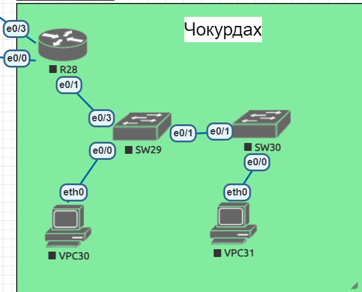

### 1-2 Настройка маршрутизатора
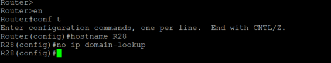
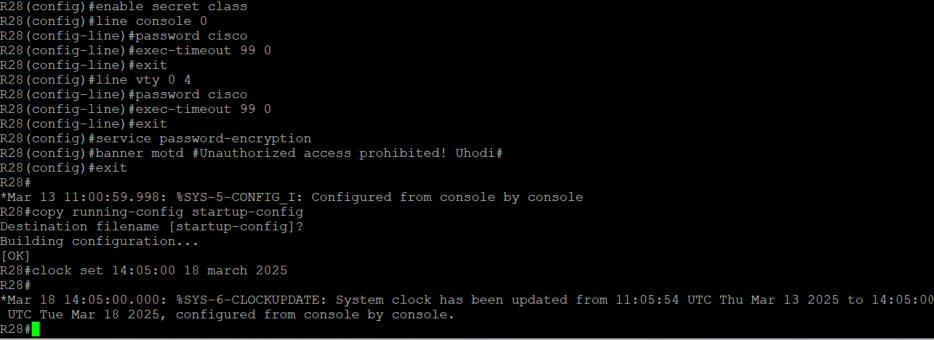

### 1-3 Настройка коммутаторов
Пример настройки одного из них 

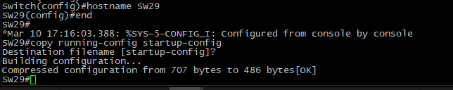 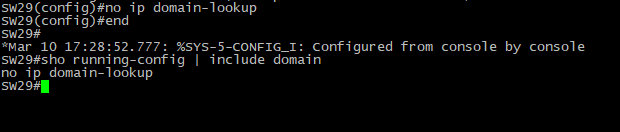
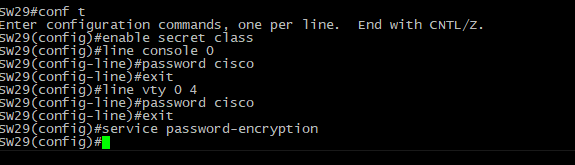 
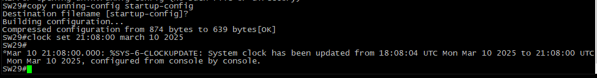

### Настройка ПК
Пример настройки одного из них

### 2 Создание и настройка влан на коммутаторах

Пример настройки на одном из коммутаторов некоторых из vlan-ов

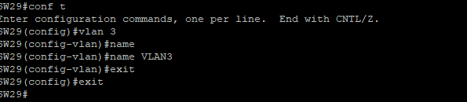

Тут ошибочно использую 999 вместо 7

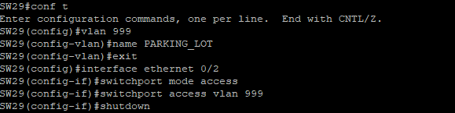

### 3 Настройка транка на коммутаторе
Настройка порта между коммутаторами

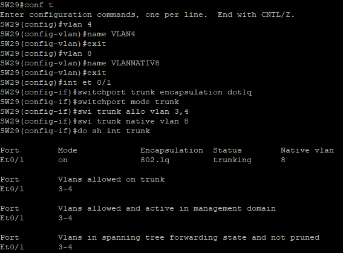

Настройка порта между коммутатором и маршрутизатором

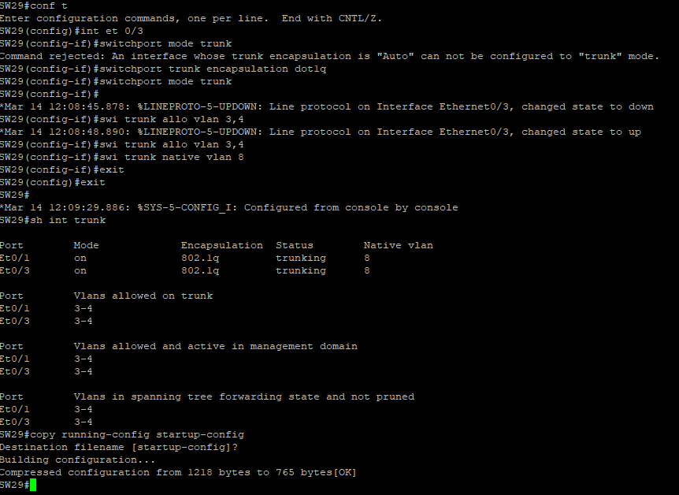

### 4 Настройка интерфейсов на маршрутизаторе

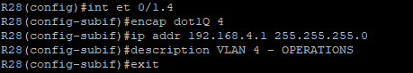

### 5 Проверка работоспосодности
Несколько примеров успешной работы

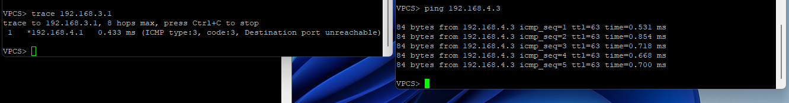