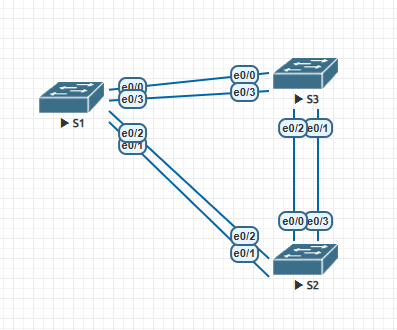
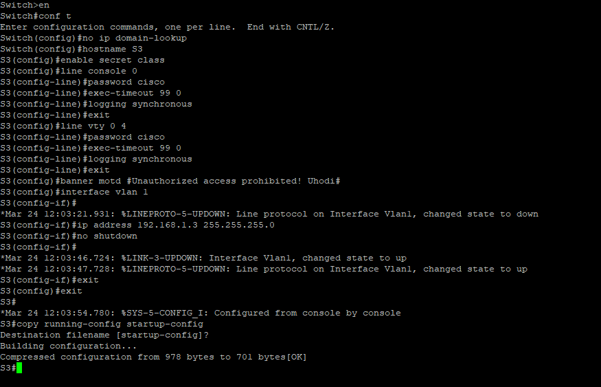
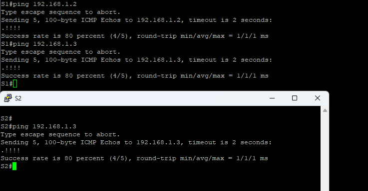
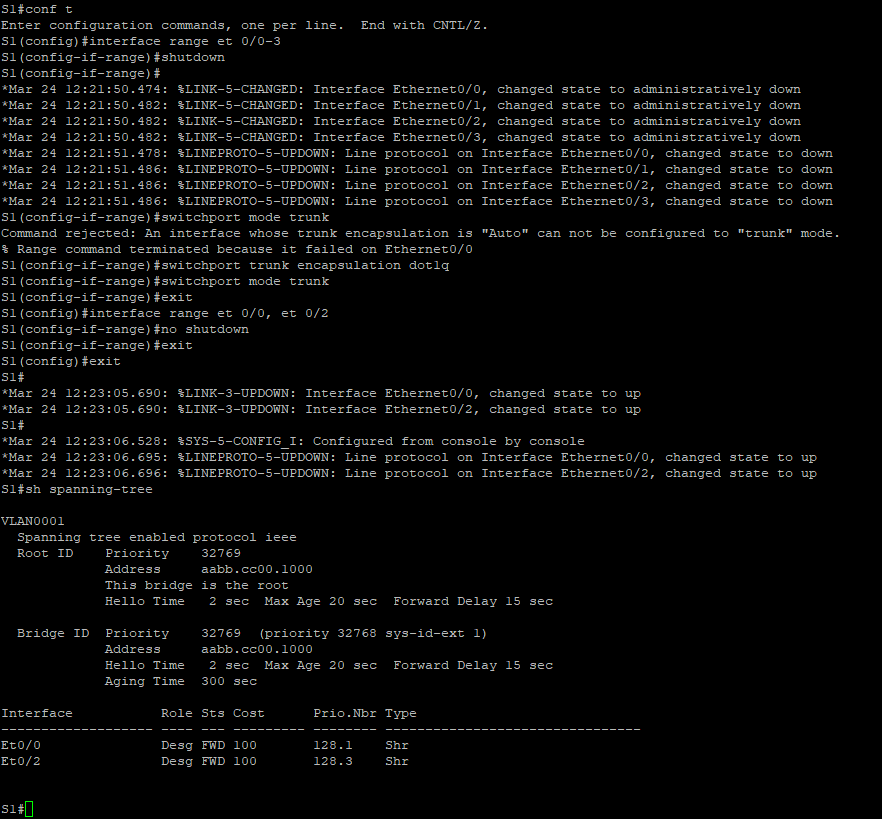
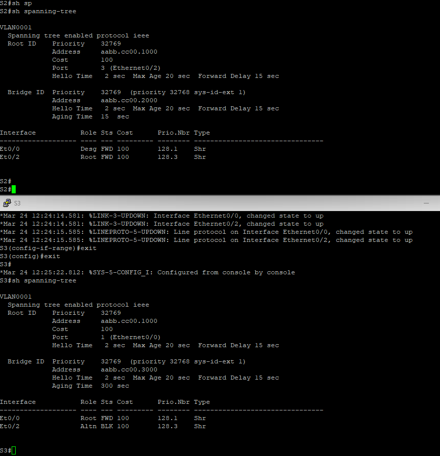
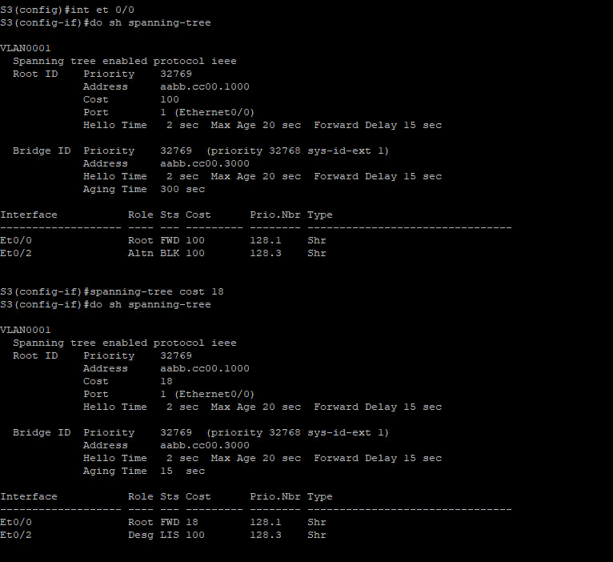
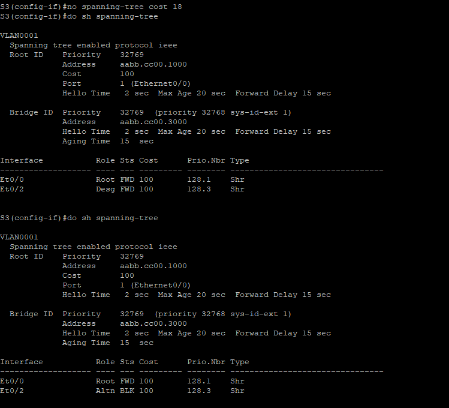
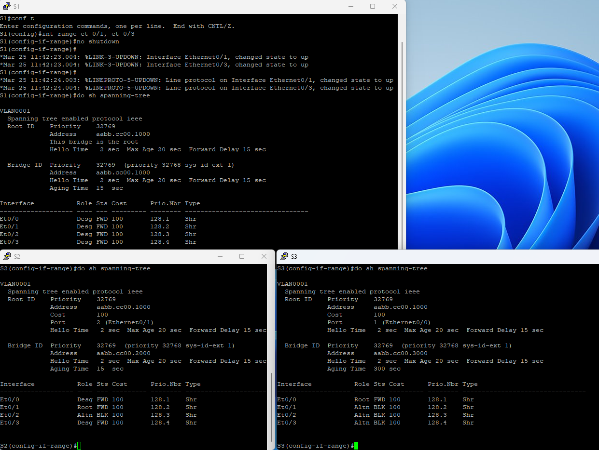

### ДЗ STP/PVST

## Топология

Небольшие изменения с методичкой все F 0/4 это et 0/0

## 1 Настройка основных параметров

Проверяем связанность

## 2 В поисках Root

Шаги 1-4 на примере S1 

S2 и S3

# Корневой коммутатор - S1

Причина - Bridge ID равны а у S1 наименьший MAC

# Корневые порты 

S2 - Et0/2
S3 - Et0/0

# Назначенные порты

S1 - Et0/0 Et0/2
S2 - Et0/0

# Альтернативный порт 

S3 - Et0/2 - Единственный альтернативный путь к Root 
+ у S3 Bridge ID меньше поэтому порт Et0/0 на S2 - назначенный

## 3 Меняем стоимость портов 

На S3 

Возвращаем

## 4 Включаем все порты на всех коммутаторах

Корневые порты 

S2 - Et0/1

S3 - Et0/0

В обоих случаях выбран порт с меньшим номером в сторону S1(Root) тк "стоимости" равны
