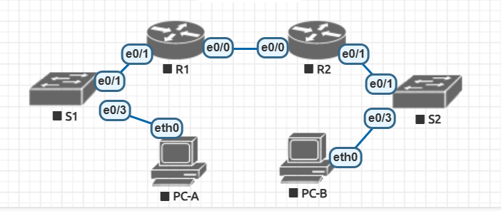

# ДЗ к занятию DHCPv4/v6 и SLAAC

# v4
## Топология и таблица адресации
Порты изменены в соответствии с нумерацией доступной в EVE

Таблица заполнена в соответствии с указаниями ниже

### 1

a.	One subnet, “Subnet A”, supporting 58 hosts (the client VLAN at R1).
#### Subnet A:192.168.1.0/26 (адреса по 192.168.1.62 + бродкаст .63)
answers here.
Record the first IP address in the Addressing Table for R1 G0/0/1.100. 
#### 192.168.1.1

b.	One subnet, “Subnet B”, supporting 28 hosts (the management VLAN at R1). 
Subnet B: 
#### 192.168.1.64/27 
Type your answers here.
Record the first IP address in the Addressing Table for R1 G0/0/1.200. Record the second IP address in the Address Table for S1 VLAN 200 and enter the associated default gateway.
#### 192.168.1.65

c.	One subnet, “Subnet C”, supporting 12 hosts (the client network at R2).
Subnet C: 
#### 192.168.1.96/28
Type your answers here.
Record the first IP address in the Addressing Table for R2 G0/0/1.
#### 192.168.1.97

### 3
