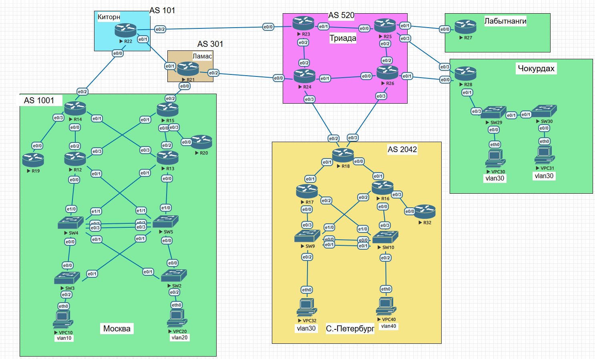
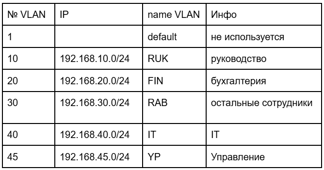
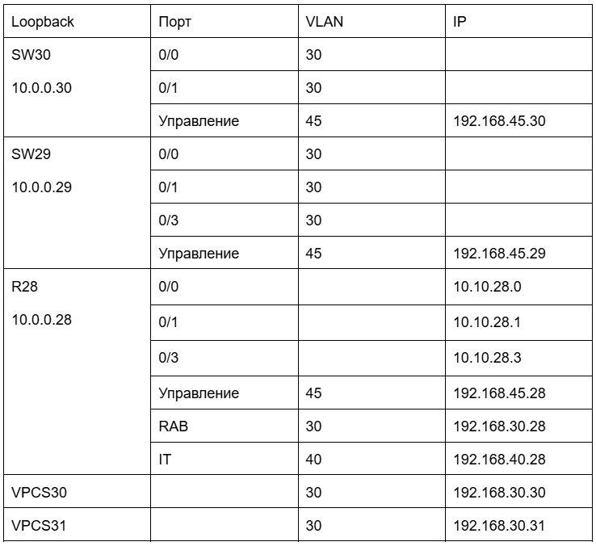

Задачи

Разработаете и задокументируете адресное пространство для лабораторного стенда.

Настроите ip адреса на каждом активном порту

Настроите каждый VPC в каждом офисе в своем VLAN.

Настроите VLAN/Loopbackup interface управления для сетевых устройств

Настроите сети офисов так, чтобы не возникало broadcast штормов, а использование линков было максимально оптимизировано

##  Меняем название ПК и вланов для удобства и назначаем адреса в таблице 

Также оставляем добавленный в прошлой лабе SW30 в Чокурдах

### Вланы

Дальше для удобства выдаем адреса 10.10.номер коммутатора.номер порта из сети

Loopback - 10.0.0.номер коммутатора

Vlan - 192.168.номер влан.номер коммутатора

## Чокурдах

## Триада + Лабытнанги

##  СПБ

## МСК

## Пример настройки VPC

## Пример настройки коммутаторов и маршрутизаторов

Для маршрутизации Vlan используется технология "роутер на палочке" через сабинтерфейсы на маршрутизаторе R28

В офисе Санкт-Петербург маршрутизация Vlan осуществляется сразу на коммутаторах SW9 и SW10 посредством SVI интерфейсов который будут шлюзом по умолчанию для пользовательских хостов сети:

SW9 - int Vlan 30 - 192.168.30.1/24

SW10 - int Vlan 40 - 192.168.40.1/24

В офисе Москва на L2 сегменте сети организованна отказаустойчивость за счет избыточности линков с использованием технологии HSRP соответственно на L3 коммутаторах SW4 SW5 помимо SVI интерфейсов VLAN подняты виртуальные шлюзы по умолчанию для соответсвующих VLAN.

SW4

interface Vlan10

 ip address 192.168.10.4 255.255.255.0
 
 standby 1 ip 192.168.10.1
 
 standby 1 priority 110
 
 standby 1 preempt

 
 
interface Vlan20

 ip address 192.168.20.4 255.255.255.0
 
 standby 2 ip 192.168.20.1
 
 standby 2 preempt

 
SW5

interface Vlan10

ip address 192.168.10.5 255.255.255.0

standby 1 ip 192.168.10.1

standby 1 preempt

interface Vlan20

ip address 192.168.20.5 255.255.255.0

standby 2 ip 192.168.20.1

standby 2 priority 110

standby 2 preempt

